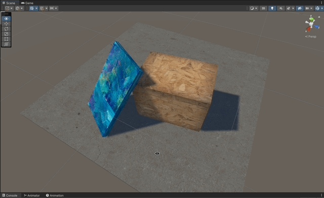
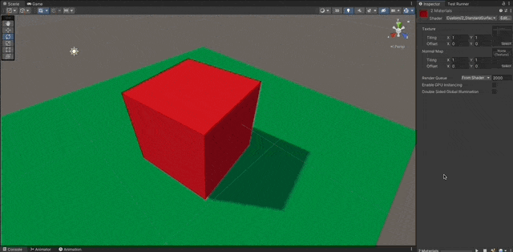

# Surface Shaders

Standard Surface Shaders written in Cg for Unity Built-in RP

### References

- [Learn Unity Shaders from Scratch - Nik Lever](https://www.udemy.com/course/learn-unity-shaders-from-scratch)
- [Textures Resources](https://3dtextures.me)

## Shaders

- [Basic Standard Surface](#basic-standard-surface)
- [Normal Maps](#normal-maps)

## Screenshots

---

## Basic Standard Surface

1. Implement a stripped standard surface shader.
1. Add the compiler directive `#pragma surface surf Lambert` indicating which function will be used to generate the passes and also which lighting model to use. (See the doc)[https://docs.unity3d.com/Manual/SL-SurfaceShaders.html].
1. Use a `sampler2D _MainTex` and make sure the naming convention is followed, defining a `float2 uv_MainTex;` in the input struct.
1. Set the `Albedo` to whatever pixel corresponds from the texture `tex2D (_MainTex, IN.uv_MainTex);`

```c
Shader "Custom/1_StandardSurface"
{
    Properties
    {
        _MainTex ("Texture", 2D) = "white" {}
    }
    SubShader
    {
        Tags { "RenderType"="Opaque" }

        CGPROGRAM
        #pragma surface surf Lambert

        sampler2D _MainTex;

        struct Input
        {
            float2 uv_MainTex;
        };

        void surf (Input IN, inout SurfaceOutput o)
        {
            // Albedo comes from a texture tinted by color
            o.Albedo = tex2D (_MainTex, IN.uv_MainTex).rgb;
        }
        ENDCG
    }
    FallBack "Diffuse"
}
```



## Normal Maps

1. Use [textures](https://3dtextures.me/2018/10/09/blocks-001/) that also have available normal maps.
1. Use a secondary `sample2D` and set it to the `Normal` property of the `SurfaceOutput` struct.

```c
void surf (Input IN, inout SurfaceOutput o)
{
    // Albedo comes from a texture tinted by color
    o.Albedo = tex2D (_MainTex, IN.uv_MainTex).rgb;
    o.Normal = tex2D(_NormalMap, IN.uv_NormalMap);
}
```


