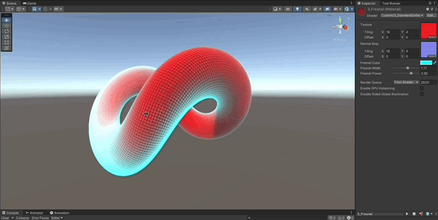

# Surface Shaders

Standard Surface Shaders written in Cg for Unity Built-in RP

### References

- [Learn Unity Shaders from Scratch - Nik Lever](https://www.udemy.com/course/learn-unity-shaders-from-scratch)
- [Textures Resources](https://3dtextures.me)
- [Sky Maps](https://assetstore.unity.com/packages/2d/textures-materials/sky/free-real-skies-87740)

## Shaders

- [Basic Standard Surface](#basic-standard-surface)
- [Normal Maps](#normal-maps)
- [Fresnel](#fresnel)
- [Environment Mapping](#environment-mapping)

## Basic Standard Surface

1. Implement a stripped standard surface shader.
1. Add the compiler directive `#pragma surface surf Lambert` indicating which function will be used to generate the passes and also which lighting model to use. [See the doc](https://docs.unity3d.com/Manual/SL-SurfaceShaders.html).
1. Use a `sampler2D _MainTex` and make sure the naming convention is followed, defining a `float2 uv_MainTex;` in the input struct.
1. Set the `Albedo` to whatever pixel corresponds from the texture `tex2D (_MainTex, IN.uv_MainTex);`

```c
Shader "Custom/1_StandardSurface"
{
    Properties
    {
        _MainTex ("Texture", 2D) = "white" {}
    }
    SubShader
    {
        Tags { "RenderType"="Opaque" }

        CGPROGRAM
        #pragma surface surf Lambert

        sampler2D _MainTex;

        struct Input
        {
            float2 uv_MainTex;
        };

        void surf (Input IN, inout SurfaceOutput o)
        {
            o.Albedo = tex2D (_MainTex, IN.uv_MainTex).rgb;
        }
        ENDCG
    }
    FallBack "Diffuse"
}
```


## Normal Maps

> NOTE: These are also called "Bump"

1. Use [textures](https://3dtextures.me/2018/10/09/blocks-001/) that also have available normal maps.
1. Use a secondary `sampler2D` and set it to the `Normal` property of the `SurfaceOutput` struct.

```c
void surf (Input IN, inout SurfaceOutput o)
{
    o.Albedo = tex2D (_MainTex, IN.uv_MainTex).rgb;
    o.Normal = tex2D(_NormalMap, IN.uv_NormalMap);
}
```


## Fresnel

1. Calculate the dot product between the `Normal` of the pixel, and the `viewDir` coming from the camera.
1. The closer the angle it is to 90 degrees, the stronger the Fresnel effect will be.

```c
// fresnel
float fresnelDot = dot(o.Normal, normalize(IN.viewDir));
fresnelDot = saturate(fresnelDot); // clamp to 0,1
float fresnel = max(0.0, _FresnelWidth - fresnelDot); // fresnelDot is zero when normal is 90 deg angle from view dir

o.Emission = _FresnelColor * pow(fresnel, _FresnelPower);
```



## Environment Mapping

1. Expose a `CUBE` property in `ShaderLab` and then bind it to a `samplerCUBE` in the `Cg` program.
1. Use the Unity provided value `worldRefl` which represents the incoming rays from the world into the vertices.
1. Use `tex2D` to find the texel in the cube map, and set it to the emission output.

```c
_SkyBox ("Sky Box", CUBE) = "" {}

struct Input
{
    float2 uv_MainTex;
    float3 worldRefl;
};

void surf (Input IN, inout SurfaceOutput o)
{
    o.Albedo = tex2D (_MainTex, IN.uv_MainTex).rgb;
    o.Emission = texCUBE(_SkyBox, IN.worldRefl).rgb;
}
```


