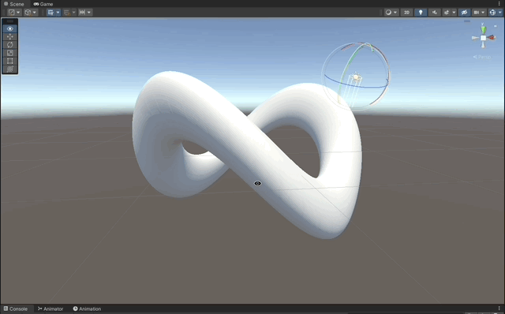

# Surface Shaders

Standard Surface Shaders written in Cg for Unity Built-in RP

### References

- [Learn Unity Shaders from Scratch - Nik Lever](https://www.udemy.com/course/learn-unity-shaders-from-scratch)
- [Textures Resources](https://3dtextures.me)
- [Sky Maps](https://assetstore.unity.com/packages/2d/textures-materials/sky/free-real-skies-87740)

## Shaders

#### Lambert Lighting

- [Basic Standard Surface](#basic-standard-surface)
- [Normal Maps](#normal-maps)
- [Fresnel](#fresnel)
- [Environment Mapping](#environment-mapping)
- [Bump Reflections](#bump-reflections)

#### Blinn-Phong Lighting

- [Blinn-Phong](#blinn-phong)

#### Custom Lighting

- [Custom Lambert](#custom-lambert)
- [Toon Shading](#toon-shading)

## Basic Standard Surface

1. Implement a stripped standard surface shader.
1. Add the compiler directive `#pragma surface surf Lambert` indicating which function will be used to generate the passes and also which lighting model to use. [See the doc](https://docs.unity3d.com/Manual/SL-SurfaceShaders.html).
1. The `Lambert` lighting model uses the `dot` product between the `Normal` of the pixel, and the `Light` direction vector, [see reference](https://medium.com/shader-coding-in-unity-from-a-to-z/light-in-computer-graphics-be438e13522f).
1. Use a `sampler2D _MainTex` and make sure the naming convention is followed, defining a `float2 uv_MainTex;` in the input struct.
1. Set the `Albedo` to whatever pixel corresponds from the texture `tex2D (_MainTex, IN.uv_MainTex);`

```c
Shader "Custom/1_StandardSurface"
{
    Properties
    {
        _MainTex ("Texture", 2D) = "white" {}
    }
    SubShader
    {
        Tags { "RenderType"="Opaque" }

        CGPROGRAM
        #pragma surface surf Lambert

        sampler2D _MainTex;

        struct Input
        {
            float2 uv_MainTex;
        };

        void surf (Input IN, inout SurfaceOutput o)
        {
            o.Albedo = tex2D (_MainTex, IN.uv_MainTex).rgb;
        }
        ENDCG
    }
    FallBack "Diffuse"
}
```


### How Lambert Lighting Works

[Lighting in Unity by Ahmed Schrute](https://medium.com/shader-coding-in-unity-from-a-to-z/light-in-computer-graphics-be438e13522f)


## Normal Maps

> NOTE: These are also called "Bump"

1. Use [textures](https://3dtextures.me/2018/10/09/blocks-001/) that also have available normal maps.
1. Use a secondary `sampler2D` and set it to the `Normal` property of the `SurfaceOutput` struct.

```c
void surf (Input IN, inout SurfaceOutput o)
{
    o.Albedo = tex2D (_MainTex, IN.uv_MainTex).rgb;
    o.Normal = tex2D(_NormalMap, IN.uv_NormalMap);
}
```


## Fresnel

1. Calculate the dot product between the `Normal` of the pixel, and the `viewDir` coming from the camera.
1. The closer the angle it is to 90 degrees, the stronger the Fresnel effect will be.

```c
// fresnel
float fresnelDot = dot(o.Normal, normalize(IN.viewDir));
fresnelDot = saturate(fresnelDot); // clamp to 0,1
float fresnel = max(0.0, _FresnelWidth - fresnelDot); // fresnelDot is zero when normal is 90 deg angle from view dir

o.Emission = _FresnelColor * pow(fresnel, _FresnelPower);
```


## Environment Mapping

1. We will use a [Sky Box](https://docs.unity3d.com/Manual/skyboxes-using.html).
1. Expose a `CUBE` property in `ShaderLab` and then bind it to a `samplerCUBE` in the `Cg` program.
1. Use the Unity provided value `worldRefl` which represents the incoming rays from the world into the vertices.
1. Use `tex2D` to find the texel in the cube map, and set it to the emission output.

```c
_SkyBox ("Sky Box", CUBE) = "" {}
```

```c
struct Input
{
    float2 uv_MainTex;
    float3 worldRefl;
};

void surf (Input IN, inout SurfaceOutput o)
{
    o.Albedo = tex2D (_MainTex, IN.uv_MainTex).rgb;
    o.Emission = texCUBE(_SkyBox, IN.worldRefl).rgb;
}
```


## Bump Reflections

1. Use a `Normal Map` texture again, in conjunction with the `Sky Map / Cube Map`.
1. Add the macro `INTERNAL_DATA` to the input struct, so Unity adds the necessary logic/math to calculate the `worldRefl` based on the new Normals.
1. Use `WorldReflectionVector()` (provided by Unity) to calculate the `worldRefl` given the newly calculated Normal for the pixel, based on the `Normal Map`.

```c
struct Input
{
    float2 uv_MainTex;
    float2 uv_NormalMap;
    float3 worldRefl;
    INTERNAL_DATA
};
```

```c
o.Emission = texCUBE(_SkyBox, WorldReflectionVector(IN, o.Normal)).rgb;
```


## Blinn-Phong

1. Use the compiler directive `Blinn-Phong` to set the lighting model.
1. `Phong` used the angle between the `viewDir` form the camera, and the reflected light direction. The reflected light is calculated by mirroring it against the normal of the pixel.
   1. `Blinn` later optimized this by using the median vector between the view angle and the light angle, and comparing that with the normal.
1. Unity will define a white `_SpecColor` by default in the `Cg` program, but you need to expose it in `ShaderLab` if you want to change its color.

```c
#pragma surface surf BlinnPhong
```

```c
_SpecColor("Specular Color", Color) = (1,1,1,1)
_SpecPower("Specular Power", Range(0,1)) = 0.5
_Glossiness("Glossiness", Range(0,1)) = 1
```

```c
void surf (Input IN, inout SurfaceOutput o)
{
    o.Albedo = tex2D (_MainTex, IN.uv_MainTex).rgb;
    o.Specular = _SpecPower;
    o.Gloss = _Glossiness;
}
```


### How Blinn-Phong Lighting Works

[Advanced Lighting by Learn OpenGL](https://learnopengl.com/Advanced-Lighting/Advanced-Lighting)


## Custom Lambert

1. In the standard surface shader you can change the pragma instruction to use a custom function as lighting model.
1. Following the naming convention `LightingXXX`.

```c
#pragma surface surf MyCustomLambert
```

```c
half4 LightingMyCustomLambert (SurfaceOutput s, half3 lightDir, half atten){
    // dot product between normal and light vector, provide the basis for the lit shading
    half lightInfluence = max(0, dot(s.Normal, lightDir)); // avoid negative values

    half4 color;
    color.rgb = s.Albedo * _LightColor0.rgb * lightInfluence * atten;
    color.a = s.Alpha;

    return color;
}
```



## Toon Shading

1. Make the custom Lambert shading ramp in bands.
1. Define another `Pass`, to expand the vertices positions and render an outline using `Cull Front`.

```c
half3 ramp = floor(lightInfluence * _ToonShadeLevelCount) / _ToonShadeLevelCount;

half4 color;
color.rgb = s.Albedo * _LightColor0.rgb * ramp * atten;
```

```c
Pass {
    Cull Front

    CGPROGRAM
    #pragma vertex vert
    #pragma fragment frag

    float _OutlineWidth;
    fixed4 _OutlineColor;

    float4 vert (float4 position: POSITION, float3 normal: NORMAL) : SV_POSITION
    {
        position.xyz += normal * _OutlineWidth;
        return UnityObjectToClipPos(position);
    }

    half4 frag () : SV_TARGET
    {
        return _OutlineColor;
    }

    ENDCG
}
```


